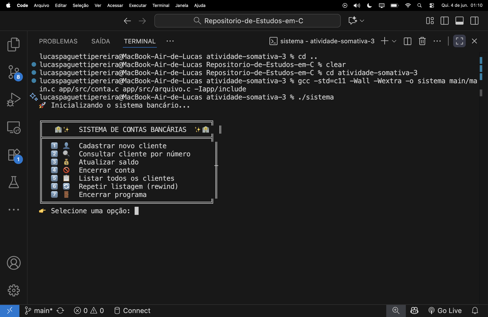
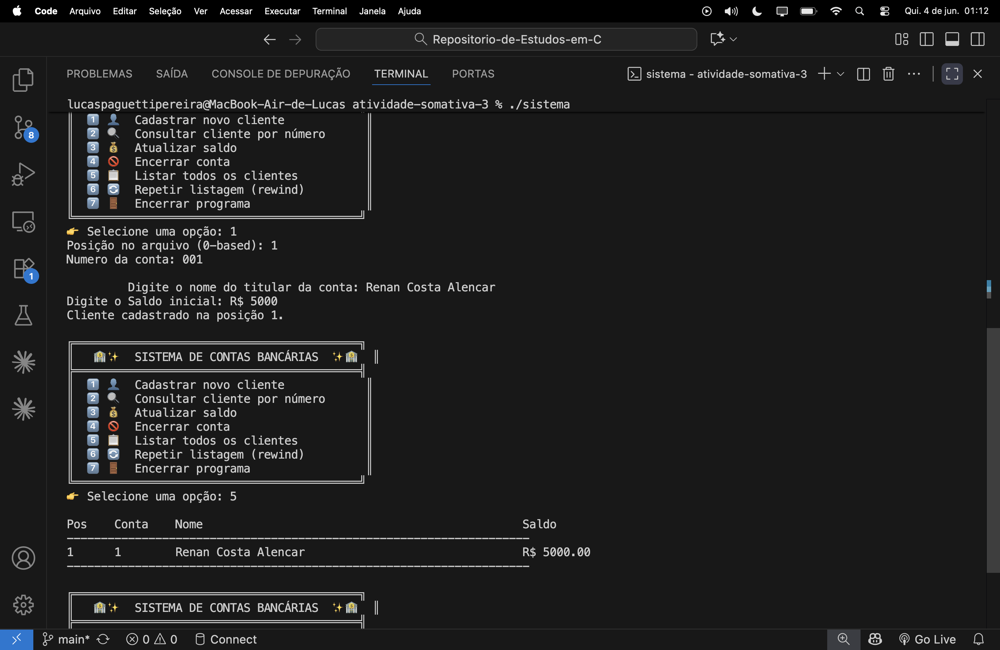
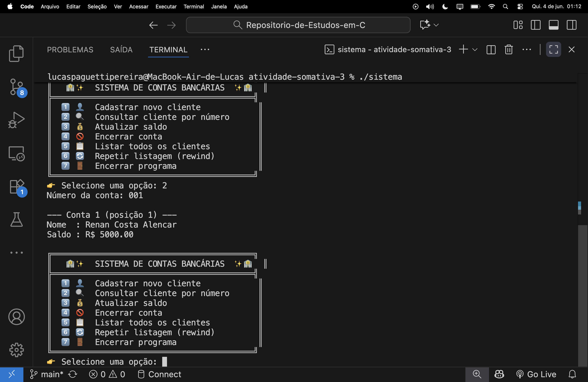
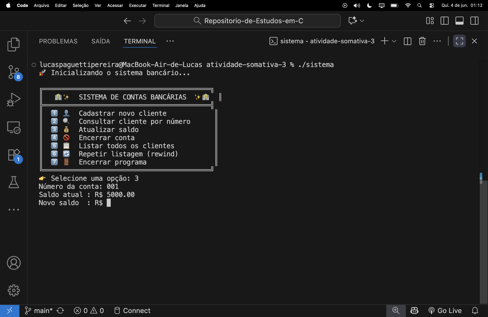
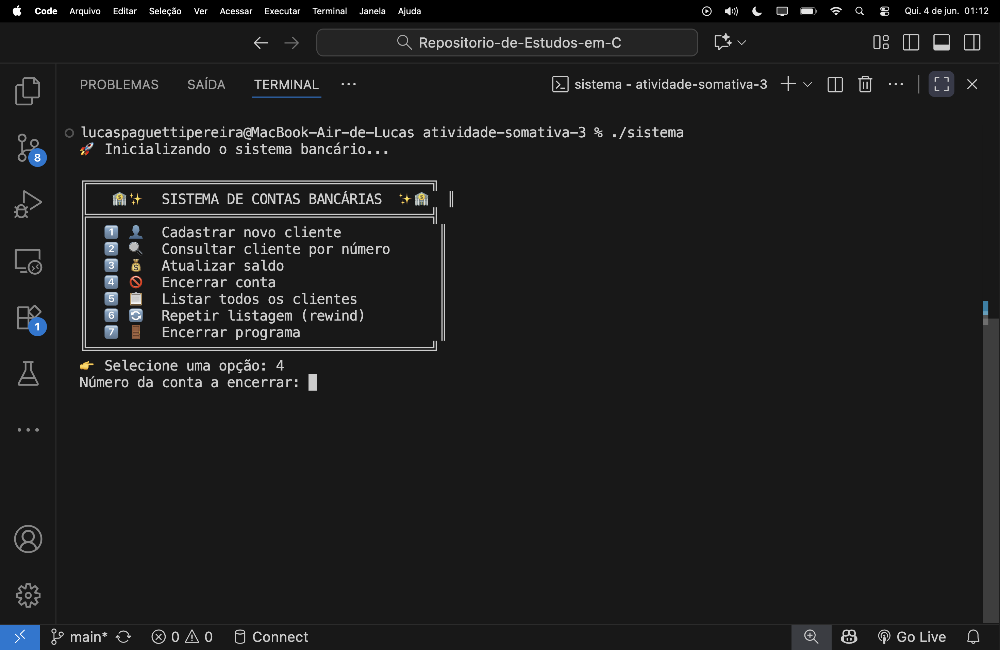

<h1 align="center">🏦 Sistema de Manutenção de Contas Bancárias em C</h1>

<p align="center">
  
  
  
  
  
  <br>
  
  
  
</p>

> **Atividade Somativa (3) — 2026/06/02**

Sistema de cadastro e gerenciamento de contas bancárias em C, usando **arquivo binário de registros de tamanho fixo** com acesso direto por posição via `fseek`, leitura/escrita via `fread`/`fwrite` e releitura via `rewind`.

<h2 align="center">📋 Menu de Opções <br>
</h2>

| # | Opção | Descrição |
|---|-------|-----------|
| 1 | 📥 Cadastrar cliente | Insere um novo cliente em uma posição específica do arquivo |
| 2 | 🔍 Consultar cliente | Busca e exibe os dados de uma conta pelo número |
| 3 | 💰 Atualizar saldo | Altera o saldo de uma conta existente |
| 4 | ❌ Encerrar conta | Remove um cliente zerando o registro (libera a posição) |
| 5 | 📋 Listar clientes | Exibe todos os registros ativos do arquivo |
| 6 | 🔄 Repetir listagem | Usa `rewind()` para reler o arquivo do início |
| 7 | 🚪 Encerrar programa | Fecha o arquivo e finaliza a execução |

<h2 align="center">🏗️ Arquitetura da Atividade <br>
</h2>

O código é dividido em três módulos com responsabilidades bem definidas:

<pre>
atividade-somativa-3 /
│
├── main /
│   └── main.c   
│
└── app /
    ├── include /
    │   ├── conta.h  
    │   └── arquivo.h  
    └── src /
        ├── conta.c  
        └── arquivo.c  
</pre>

<h3 align="center">🔗 Diagrama de dependências <br>
</h3>

<p align="center">
  
  
  
  
</p>

```
main/main.c
 ├── app/include/conta.h   /   app/src/conta.c
 │    └── app/include/arquivo.h / app/src/arquivo.c
 │         └── app/include/conta.h  (struct Cliente)
 └── app/include/arquivo.h / app/src/arquivo.c
```

<h2 align="center">🧱 Estrutura do Registro <br>
</h2>

Cada conta ocupa exatamente `sizeof(Cliente)` bytes no arquivo binário — sem padding variável, sem separadores, sem nova linha:

```c
typedef struct
{
    int    numero;        // 0 = posição livre / conta encerrada
    char   nome[50];      // nome do titular (tamanho fixo)
    double saldo;         // saldo em reais
} Cliente;
```

| Campo | Tipo | Tamanho | Observação |
|-------|------|---------|------------|
| `numero` | `int` | 4 bytes | `0` indica posição vazia |
| `nome` | `char[50]` | 50 bytes | sempre 50 bytes, sem importar o tamanho do nome |
| `saldo` | `double` | 8 bytes | precisão de 2 casas decimais na exibição |
| **Total** | — | **~62 bytes** | pode variar por alinhamento/padding do compilador |

<h2 align="center">📂 Arquivo Binário — Como o Acesso Funciona <br>
</h2>

O arquivo `contas.bin` armazena os registros lado a lado. Para acessar a posição `i` diretamente:

```
offset = i × sizeof(Cliente)
```

```
contas.bin (em bytes):
┌──────────────────┬──────────────────┬──────────────────┬──────────────────┐
│   Registro [0]   │   Registro [1]   │   Registro [2]   │   Registro [3]   │
│  numero|nome|sal │  numero|nome|sal │  numero=0 (vazio)│  numero|nome|sal │
└──────────────────┴──────────────────┴──────────────────┴──────────────────┘
      ↑ fseek(0)         ↑ fseek(1×N)       ↑ fseek(2×N)       ↑ fseek(3×N)
```

### Funções de arquivo (`app/src/arquivo.c`)

| Função | Assinatura | O que faz |
|--------|-----------|-----------|
| `arquivo_abrir` | `FILE* (const char *modo)` | `fopen` com tratamento de erro |
| `arquivo_total_registros` | `long (FILE *f)` | `fseek(SEEK_END)` + `ftell` ÷ `sizeof` |
| `arquivo_ler` | `int (FILE*, long pos, Cliente*)` | `fseek` + `fread` na posição `pos` |
| `arquivo_escrever` | `void (FILE*, long pos, const Cliente*)` | `fseek` + `fwrite` na posição `pos` |

### Modos de `fopen` (file open - modo de abertura de arquivo) utilizados

| Modo | Lê | Escreve | Cria se não existir | Trunca | Posição inicial |
|------|----|---------|---------------------|--------|-----------------|
| `"ab"` | ❌ | ✅ (append) | ✅ | ❌ | Final do arquivo |
| `"rb+"` | ✅ | ✅ | ❌ | ❌ | Início do arquivo |

**`"ab"` — append binário**
Usado logo no início de `conta_cadastrar` apenas para **garantir que o arquivo existe**. Se `contas.bin` ainda não foi criado, o `fopen("ab")` o cria vazio. Se já existir, não apaga nada nem move dados — apenas abre e fecha. Qualquer escrita feita nesse modo iria para o final do arquivo, mas aqui o `fclose` é chamado imediatamente sem escrever nada; o objetivo é só a criação implícita.

**`"rb+"` — leitura e escrita binária**
Usado em `conta_cadastrar`, `conta_atualizar_saldo` e `conta_encerrar`. Abre o arquivo existente permitindo **leitura e escrita simultâneas** sem apagar o conteúdo. É o modo correto para atualizar um registro específico via `fseek` + `fwrite`: o ponteiro vai direto à posição desejada e sobrescreve apenas aqueles bytes, mantendo todos os outros intactos. Exige que o arquivo já exista — por isso o `"ab"` é necessário antes.

<h2 align="center">⚙️ Detalhes de Implementação <br>
</h2>

### 📥 Cadastrar (opção 1)
- Recebe a posição desejada (0-based)
- Verifica se a posição já está ocupada (`numero != 0`) antes de sobrescrever
- Número `0` é reservado para indicar registro vazio — não pode ser usado como número de conta

### ❌ Encerrar conta (opção 4)
- Usa `memset(&c, 0, sizeof(Cliente))` para zerar completamente o registro
- A posição é **liberada** no arquivo (pode ser reutilizada no cadastro)
- O arquivo não encolhe — o espaço permanece como posição vazia

### 🔄 Rewind (opção 6)
- Um único `FILE *f_lista` fica aberto durante toda a sessão em `main/main.c`
- Após cadastro, atualização ou encerramento, `f_lista` é **reaberto** para refletir as mudanças
- A opção 6 chama `rewind(f_lista)` explicitamente antes de reler, demonstrando o uso da função

<h2 align="center">🚀 Como Compilar e Executar <br>
</h2>

```bash
cd atividade-somativa-3
```

```bash
# Compilar (padrão C11, todos os warnings ativos)
gcc -std=c11 -Wall -Wextra -o sistema main/main.c app/src/conta.c app/src/arquivo.c -Iapp/include

# Executar
./sistema
```

> O arquivo `contas.bin` é criado automaticamente na primeira execução, se não existir.

<h2 align="center">🧠 Explicação do <code>main/main.c</code> <br>
</h2>

O `main.c` é o ponto de entrada e o **controlador do loop principal**. Ele não implementa nenhuma lógica de negócio — apenas orquestra as chamadas e gerencia o `FILE *f_lista`.

```
main()
│
├── 1. Inicializa o arquivo binário em modo "ab"
│      └── garante que contas.bin existe antes de qualquer leitura
│
├── 2. Abre f_lista em modo "rb" (leitura sequencial para listar)
│      └── fica aberto durante toda a sessão
│
├── 3. Loop do-while (opcao != 7)
│   │
│   ├── exibir_menu()  → imprime as opções 1-7
│   ├── scanf("%d", &opcao)  → lê a escolha
│   │
│   └── switch(opcao)
│       ├── case 1 → conta_cadastrar()   + reopen f_lista (arquivo mudou)
│       ├── case 2 → conta_consultar()   (só lê, f_lista não precisa reopen)
│       ├── case 3 → conta_atualizar_saldo() + reopen f_lista
│       ├── case 4 → conta_encerrar()    + reopen f_lista
│       ├── case 5 → conta_listar(f_lista)
│       ├── case 6 → rewind(f_lista) + conta_listar(f_lista)
│       └── case 7 → mensagem de saída
│
└── 4. Fecha f_lista e retorna EXIT_SUCCESS
```

**Por que `f_lista` é reaberto nos cases 1, 3 e 4?**
O arquivo `contas.bin` foi modificado por outra chamada `fopen/fclose` interna. O ponteiro `f_lista` aberto em `"rb"` não enxerga os novos dados até ser reaberto — por isso é fechado e reaberto após cada escrita.

**Por que o case 6 chama `rewind` antes de `conta_listar`?**
`conta_listar` já faz `rewind` internamente, então a chamada extra do case 6 é redundante (mas inofensiva). A opção existe para demonstrar explicitamente o uso de `rewind()` como conteúdo didático.

---

<h2 align="center">💡 Conceitos de C Utilizados <br>
</h2>

| Conceito | Onde é usado |
|----------|-------------|
| `fseek()` | Acesso direto a qualquer posição do arquivo |
| `fread()` | Leitura de registros binários completos |
| `fwrite()` | Escrita de registros binários completos |
| `rewind()` | Retorna o ponteiro de leitura ao início do arquivo |
| `ftell()` | Calcula o total de registros via tamanho do arquivo |
| `memset()` | Zera o registro ao encerrar uma conta |
| Header guards | `#ifndef / #define / #endif` em todos os `.h` |
| Separação em módulos | `.h` para interface, `.c` para implementação |

---

<h2 align="center">Telas 🖥️ <br>

</h2>

<table align="center" width="780">
  <tr><th align="center">🏠 Menu Inicial</th></tr>
  <tr><td align="center"><b>Tela de entrada do sistema — o programa é compilado e executado, exibindo o menu principal com as 7 opções de gerenciamento de contas bancárias.</b></td></tr>
  <tr><td align="center"></td></tr>
</table>

<br>

<table align="center" width="780">
  <tr><th align="center">📥 Cadastro de Cliente e Listagem</th></tr>
  <tr><td align="center"><b>Opção 1 — cadastro de novo cliente: informa posição no arquivo (0-based), número da conta, nome e saldo inicial. Em seguida, opção 5 lista todos os registros ativos, confirmando que o cliente foi persistido no arquivo binário.</b></td></tr>
  <tr><td align="center"></td></tr>
</table>

<br>

<table align="center" width="780">
  <tr><th align="center">🔍 Consulta de Cliente por Número</th></tr>
  <tr><td align="center"><b>Opção 2 — busca direta pelo número da conta via <code>fseek</code>: exibe nome do titular e saldo atual sem percorrer todo o arquivo.</b></td></tr>
  <tr><td align="center"></td></tr>
</table>

<br>

<table align="center" width="780">
  <tr><th align="center">💰 Atualizar Saldo</th></tr>
  <tr><td align="center"><b>Opção 3 — localiza a conta pelo número, exibe o saldo atual e aguarda o novo valor a ser escrito via <code>fwrite</code> diretamente na posição do registro no arquivo binário.</b></td></tr>
  <tr><td align="center"></td></tr>
</table>

<br>

<table align="center" width="780">
  <tr><th align="center">❌ Encerrar Conta</th></tr>
  <tr><td align="center"><b>Opção 4 — recebe o número da conta a ser encerrada e zera o registro com <code>memset</code>, liberando a posição no arquivo para reutilização sem reduzir seu tamanho físico.</b></td></tr>
  <tr><td align="center"></td></tr>
</table>

<p align="center">
  
  
   <br>
  
  
  
</p>