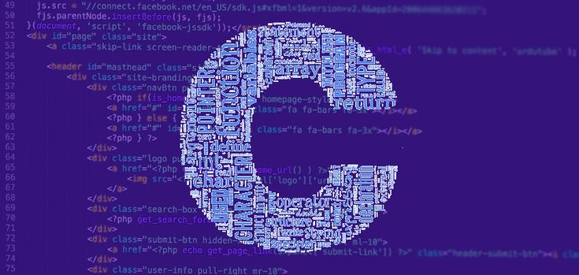

<h1 align="center">
  Estudos em Linguagem C —  
  Programação Estruturada e Sistemas
  
</h1>

  Repositório dedicado aos estudos em Linguagem C, com foco em:<strong> lógica de programação,
  estruturas de dados, manipulação de memória, algoritmos eficientes e fundamentos
  essenciais da programação inicial. 💻</strong>
    
  

<h2 align="center">👨🏻‍💻 Autor deste Repositório:</h2>

<strong>Lucas Paguetti Pereira</strong> 🧙‍♂️  
🏫 <strong>Instituição</strong>: Cesar School 🎓🧡  
📍 Recife, Pernambuco — <strong>Brazil</strong> 🇧🇷  

 

<a href="https://www.linkedin.com/in/lucas-paguetti-pereira-70267339b/">
   
</a>
<a href="mailto:lpp2@cesar.school">
   
</a>

<h2 align="center">
  🏛️ Arquitetura do Repositório:  
  
</h2>

<pre>
Estudos em C/
├── img/
│   └── C.jpeg
├── Estudos/
│   └── Cursos e Aulas Diversas (e seus exércicios).c
├── Avaliações/
│   └── avaliações.c
├── readme.md
└── LICENSE (MIT)
</pre>

<h2 align="center">🎯 Objetivo do Repositório:</h2>

Este repositório tem como objetivo desenvolver fundamentos sólidos em <strong>Linguagem C</strong>,
com foco em: programação estruturada, manipulação de ponteiros, controle de memória,
estruturas de dados e resolução eficiente de problemas computacionais 🔖⚙️.

<h2 align="center">⛏️💻 Ferramentas Utilizadas:</h2>

   
    
  
  
  
  
  
   
  
  

